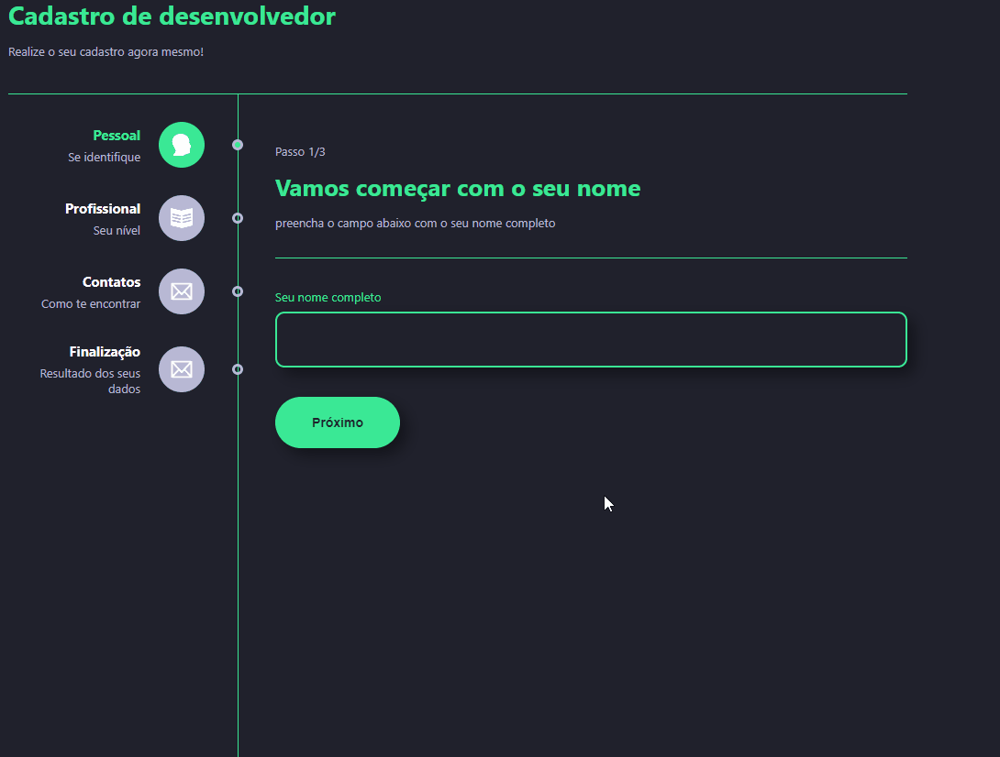

# Multiform | React + TypeScript

This project was carried out using React and Typescript. The purpose of this project was to develop a form that changes as each step progresses. At the end of the project it is possible to see what data was inserted into the form.
 

## First steps

`npm install`

## Available Scripts

In the project directory you can run:

### `npm start`

Run the application in development mode.\
Open it [http://localhost:3000](http://localhost:3000) to view it in the browser.

The page will reload if you make edits.\
You will also see lint errors in the console.

### `npm test`

Start the test runner in interactive view.\
See the section on [test execution](https://facebook.github.io/create-react-app/docs/running-tests) for more information.

### `npm run build`

Build the application for production in the `build`.\ folder
It correctly bundles React in production mode and optimizes the build for the best performance.
Compilation is shortened and filenames include the hashes.\
Your app is ready to be deployed!
See the section on [implantation](https://facebook.github.io/create-react-app/docs/deployment) for more information.
 

## Technologies used:
> TypeScript; 
> Styled-Components; 
> CSS; 
> HTML; 
> Node.Js; 
> React Router 

 

| Made with ❤️ by ANDRÉ NICOLAS CORDEIRO ✌️ [LinkedIn](https://www.linkedin.com/in/andr%C3%A9-nicolas-cordeiro-1b755522a/)